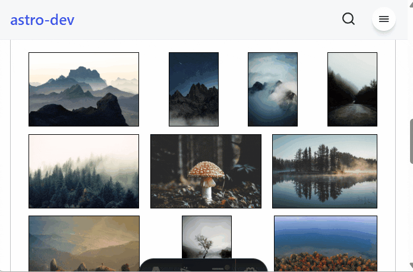

<div align="center" style="background-color: black; padding: 1rem;">
  <a href="https://lightgalleryjs.com" target="_blank"></a>
  &nbsp;&nbsp;&nbsp;&nbsp;&nbsp;
  <a href="https://astro.build/" target="_blank"></a>
  <h1>Astro LightGallery</h1>
  <p>
    Astro LightGallery is the native Astro component for
    <a href="https://www.lightgalleryjs.com">lightGallery</a>.
    It's a feature-rich, modular JavaScript gallery plugin for
    building beautiful image and video galleries for the web and mobile devices.
  </p>
  <p>
    This component provides an easy-to-use Astro integration with TypeScript support,
    responsive layouts, automatic plugin loading, and both layout-based and custom HTML approaches.
  </p>
  
  <br/>
  <br/>
  <a href="https://pascal-brand38.github.io/astro-dev/packages/astro-lightgallery" target="_blank">DEMO</a>
</div>
<br/>
<br/>

## Installation

Get the latest version from NPM:

```bash
npm install astro-lightgallery
```

### Requirements

- Astro 5.x or higher
- TypeScript support (included)

The package automatically includes the required lightGallery CSS and provides TypeScript definitions.

## License

Astro-lightGallery is released under the MIT license.

Astro-lightGallery is using [lightGallery](https://github.com/sachinchoolur/lightGallery).
lightGallery is a **free and open-source library**, however,
if you are using the library for business, commercial sites, projects,
and applications, choose the **commercial license** to keep your source proprietary, to yourself.
Please refer to the [lightGallery license page](https://www.lightgalleryjs.com/license/).

## Usage

### Basic Example

Here is a simple example using the default adaptive layout:

```jsx
---
import { LightGallery } from 'astro-lightgallery'
---
<LightGallery
  layout={{
    imgs: [
      { src: "/img01.jpg", alt: "Image 1" },
      { src: "/img02.jpg", alt: "Image 2", srcThumb: "/thumb02.jpg" },
      { src: "/img03.jpg", alt: "Image 3", subHtml: "<h4>Custom Caption</h4>" },
    ]
  }}
  options={{
    thumbnail: true,
    autoplay: true,
  }}
/>
```

### API Reference

#### Component Props

The `LightGallery` component accepts the following props:

- **`layout`** (optional): Configuration for the built-in adaptive layout
  - `type`: Accepted values are `adaptive` (default) or `google-photos` (preferred one
    as responsive)
  - `imgs`: Array of image objects with `src`, optional `srcThumb`, `alt`, and `subHtml`
  - `adaptive.zoom`: Zoom factor (default: 100) to scale the gallery
  - `googlePhotos`: google photos layout parameters (cf. [Google Photos Layout Customization](https://github.com/pascal-brand38/astro-lightGallery#google-photo-layout-customization))
  - `classContainer`: Custom CSS class for the container
  - `classItem`: Custom CSS class for individual items

- **`options`** (optional): [LightGallery settings](https://www.lightgalleryjs.com/docs/settings/) object
  - Supports all native lightGallery options
  - Plugins are automatically loaded based on options (e.g., `thumbnail: true` loads thumbnail plugin)

- **`addPlugins`** (optional): Array of plugin names to load manually
  - `'thumbnail'`, `'autoplay'`, `'comment'`, `'fullscreen'`, `'hash'`, `'mediumZoom'`, `'pager'`, `'relativeCaption'`, `'rotate'`, `'share'`, `'video'`, `'vimeoThumbnail'`, `'zoom'`

- **`id`** (optional): Custom ID for the gallery (auto-generated if not provided)
- **`class`** (optional): CSS class for the gallery container

#### Image Object Properties

Each image in the `layout.imgs` array can have:

```typescript
{
  src: string,           // Required: URL of the full-size image
  srcThumb?: string,     // Optional: URL of thumbnail (defaults to src)
  alt?: string,          // Optional: Alt text for accessibility
  subHtml?: string,      // Optional: HTML caption for the image
  loading?: 'lazy' | 'eager' // Optional: Native image loading strategy
}
```

### Advanced Usage

#### Custom Layout with Slot

You can use your own HTML structure by providing content in the default slot:

```jsx
---
import { LightGallery } from 'astro-lightgallery'
---

<LightGallery
  options={{ thumbnail: true }}
  addPlugins={['zoom', 'fullscreen']}
>
  <a href="/large1.jpg" data-sub-html="Custom caption">
    
  </a>
  <a href="/large2.jpg">
    
  </a>
</LightGallery>
```

#### Adaptive Layout Customization

The adaptive layout automatically adjusts to different screen sizes and supports zoom customization:

```jsx
<LightGallery
  layout={{
    imgs: [...],
    adaptive: { zoom: 150 }, // 150% zoom
    classContainer: "my-gallery-container",
    classItem: "my-gallery-item hover:opacity-80"
  }}
/>
```

#### Google Photo Layout Customization

Google photos layout reflect the layout used on Google Photos.
The main pro over the `adaptive` layout is that it is responsive.

To use it, jus use the following:
```jsx
<LightGallery
  layout={{
    type: 'google-photos',
    imgs: [...],
  }}
/>
```

which is the same as
```jsx
<LightGallery
  layout={{
    type: 'google-photos',
    imgs: [...],
    googlePhotos: {
      height: '45vw',
      maxHeight: '45vw',
      breakpoints: {
        601: { height: '20vw', maxHeight: '205px' },
      }
    }
  }}
/>
```

This means that:
* default height and max-height of a picture is `45vw` (45% of the viewport width)
* on screen larger than 601px, height and max-height will be respectivelly 20vw and 205px

As many breakpoints as needed can be added.


#### Programmatic Access

You can access the lightGallery instance programmatically:

```javascript
import { getLightGalleryFromUniqueSelector } from 'astro-lightgallery';

// Get the lightGallery instance
const lgInstance = await getLightGalleryFromUniqueSelector('#my-gallery-id');
if (lgInstance) {
  lgInstance.openGallery(0); // Open at first image
}
```

### Styling

The component includes responsive CSS that adapts to different screen sizes:

- Desktop: Flexible height based on viewport (20vh by default)
- Portrait mode: Adjusted height (15vh)
- Small screens: Full-width layout with constrained height
- Short screens: Increased height (40vh) for better visibility

Custom styling can be applied through the `class`, `classContainer`, and `classItem` props.

### Examples

Please check the [Astro-lightgallery online documentation](https://pascal-brand38.github.io/astro-dev/packages/astro-lightgallery) for a complete set of examples, including:

- Navigation controls
- Thumbnail galleries
- Custom layouts
- Plugin configurations

Full code examples are provided for each use case.
